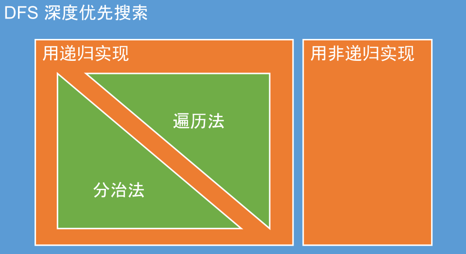

# Binary Tree

### Traverse // Divide & Conquer // Non-Recursion



####  Traverse vs Divide Conquer

• They are both Recursion Algorithm

• Result in parameter vs Result in return value

• Top down vs Bottom up


#### Example: 二叉树的前序遍历

Traverse\(注意返回值为空\)

```java
//Version 1: Traverse
public class Solution {
    public ArrayList<Integer> preorderTraversal(TreeNode root) {
        ArrayList<Integer> result = new ArrayList<Integer>();
        traverse(root, result);
        return result;
    }
    private void traverse(TreeNode root, ArrayList<Integer> result) {
        if (root == null) {
            return;
        }
        result.add(root.val);
        traverse(root.left, result);
        traverse(root.right, result);
    }
}
```

Divide & Conquer（注意返回值非空）

```java
//Version 2: Divide & Conquer
public class Solution {
    public ArrayList<Integer> preorderTraversal(TreeNode root) {
        ArrayList<Integer> result = new ArrayList<Integer>();
        // null or leaf
        if (root == null) {
            return result;
        }
        // Divide
        ArrayList<Integer> left = preorderTraversal(root.left);
        ArrayList<Integer> right = preorderTraversal(root.right);
        // Conquer
        result.add(root.val);
        result.addAll(left);
        result.addAll(right);
        return result;
    }
}
```

