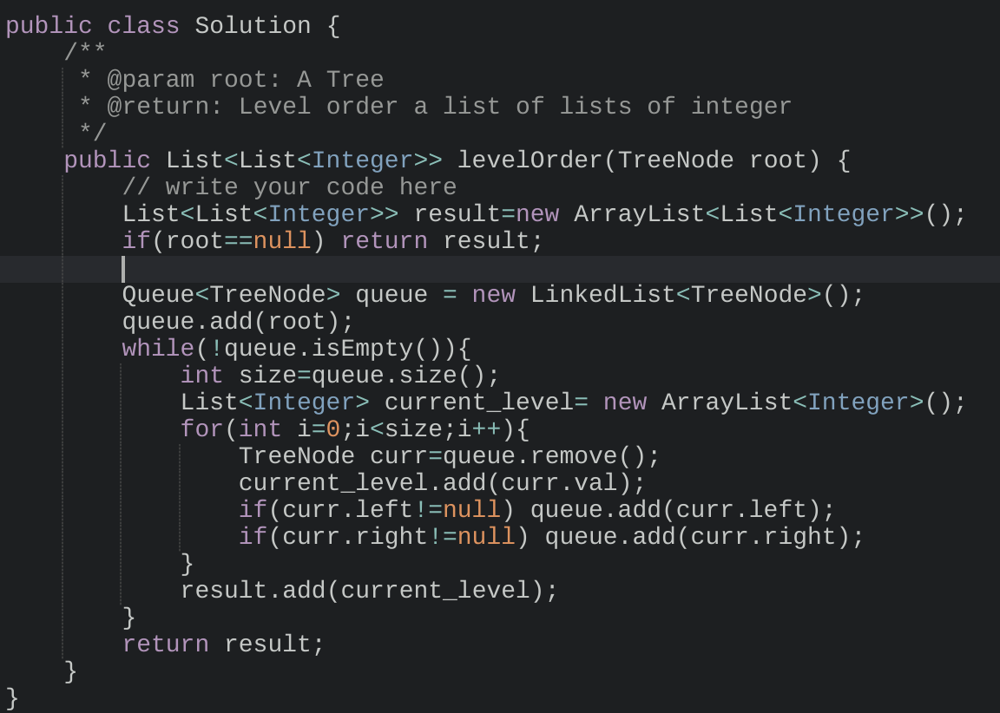

# BFS on Binary Tree

## Binary Tree Level Order Traversal

[https://www.lintcode.com/problem/binary-tree-level-order-traversal/](https://www.lintcode.com/problem/binary-tree-level-order-traversal/)

Given a binary tree, return the level order traversal of its nodes' values. \(ie, from left to right, level by level\).

## Serialize and Deserialize Binary Tree

[https://www.lintcode.com/problem/binary-tree-serialization/](https://www.lintcode.com/problem/binary-tree-serialization/)

Design an algorithm and write code to serialize and deserialize a binary tree. Writing the tree to a file is called 'serialization' and reading back from the file to reconstruct the exact same binary tree is 'deserialization'.

